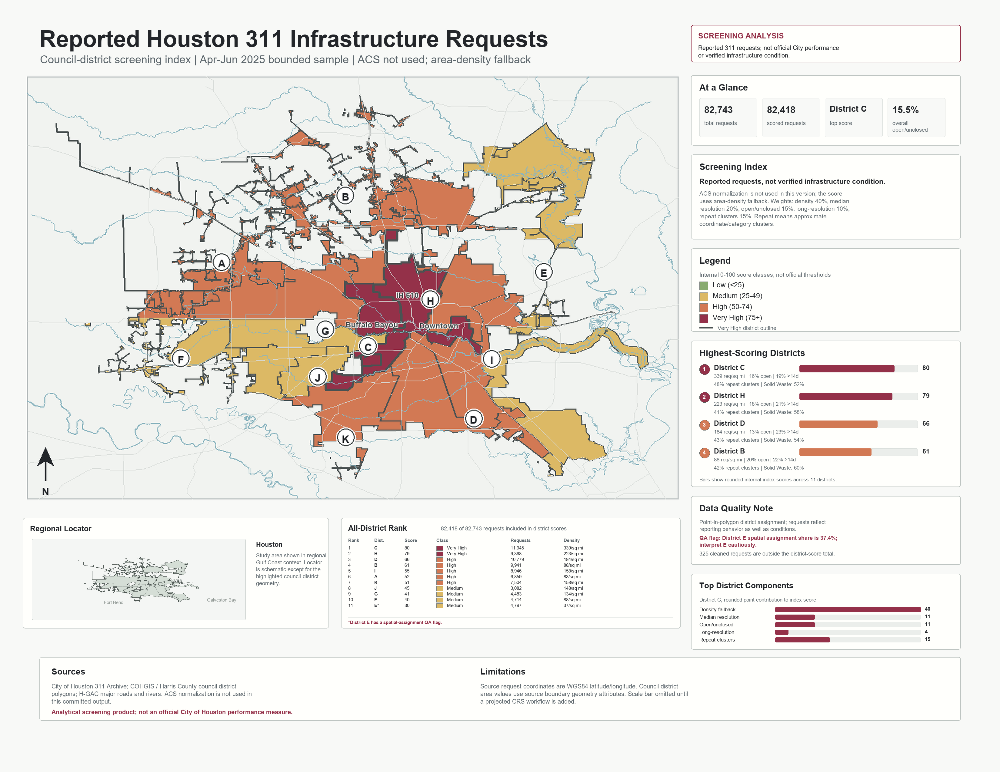
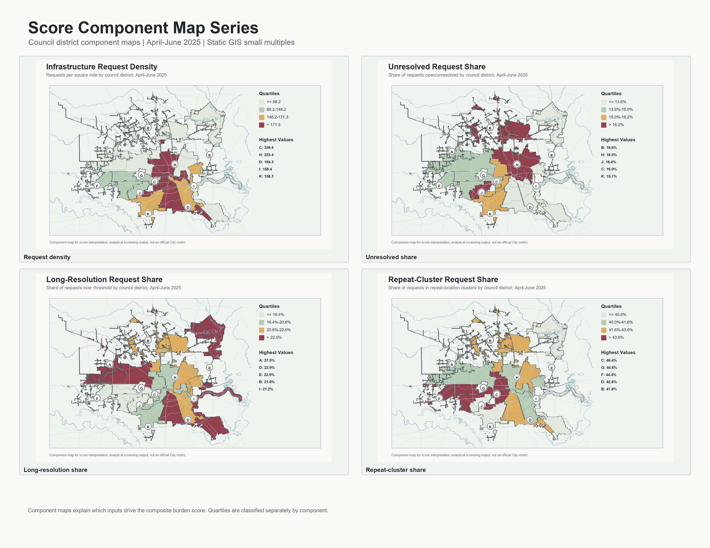
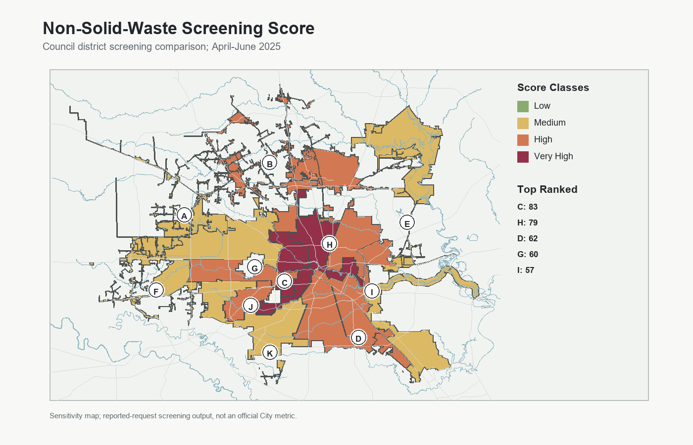
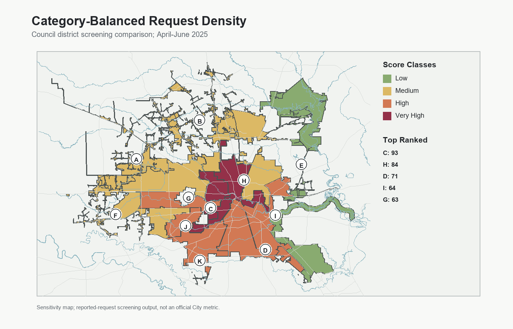
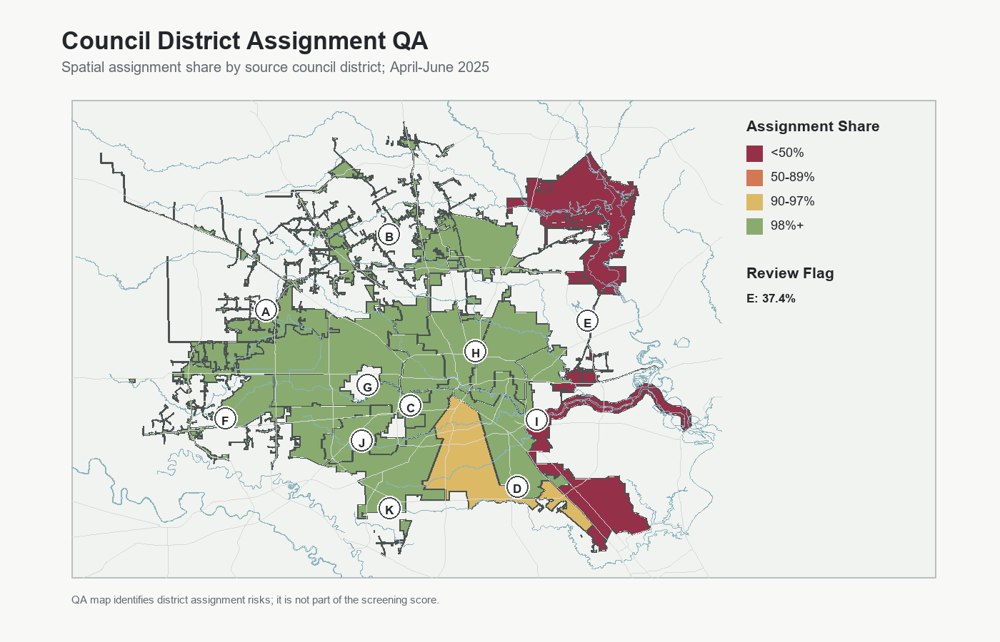

# Houston 311 Infrastructure Service Request Analysis

Portfolio-ready static GIS screening analysis of reported Houston 311 infrastructure-related requests, resolution times, repeat-location clusters, open/unclosed cases, and council-district request patterns.

The repository's primary showcase artifact is the static GIS request-screening map plate:



## Project Overview

This V3 portfolio project analyzes real City of Houston 311 service request records from the public ArcGIS archive. It is a static GIS map-production package: reproducible scripts, official council-district boundaries, point-in-polygon district assignment, optional ACS demographic normalization, QA/QC flags, summary tables, static charts, static maps, repeat-location screening, formal map deliverables, metadata, and public-sector documentation.

**Research question:** Which Houston council districts rank highest in a bounded reported-311-request screening index based on request volume, issue type, resolution time, open/unclosed cases, long-resolution cases, and recurring request clusters?

The project is designed to be understandable as a public-sector GIS case study: the code can be rerun, the assumptions are documented, and the static map/report products can be used directly in a portfolio or project write-up.

## V3 Data Scope

- 311 source: [Houston311_Archives MapServer layer](https://mycity2.houstontx.gov/gisweb01/rest/services/311/Houston311_Archives/MapServer/0)
- Query window: `2025-04-01` through `2025-06-30`
- Downloaded records: `82,743`
- Boundary source: [COH_Council_Districts](https://www.gis.hctx.net/arcgis/rest/services/CoH/CoH_Boundaries/MapServer/0)
- Map context sources: [H-GAC Major Roads](https://gis.h-gac.com/arcgis/rest/services/Open_Data/Transportation/MapServer/9) and [H-GAC Major Rivers](https://gis.h-gac.com/arcgis/rest/services/Open_Data/Environment/MapServer/1)
- Demographic source: 2024 ACS 5-year API and Census TIGERweb tract internal points, enabled when a valid `CENSUS_API_KEY` is available

In this coding environment, the Census API rejected the supplied key. V3 therefore records the ACS access limitation and falls back to area-normalized rates. The demographic fetch script is ready to produce population and household rates once a valid `CENSUS_API_KEY` is set.

## What The Score Means

The V3 score is an analytical screening index. It combines request rate, resolution time, open/unclosed share, long-resolution share, and repeat-location share into a 0-100 style percentile score by council district. Higher scores mean a district had heavier observed reported 311 infrastructure-request activity in this bounded extract.

When ACS demographics are available, request rates can be normalized by estimated residents and households. In the committed output, ACS normalization is not used because the supplied Census key was rejected; the pipeline therefore uses requests per square mile as a documented fallback. That keeps the current output reproducible while leaving the path open for population-normalized V3.1/V4 outputs later.

The score is not an official City of Houston metric, not a causal model, not a government-performance measure, and not a complete measure of infrastructure condition. 311 requests reflect reporting behavior as well as conditions.

## Key V3 Findings

- The April-June 2025 extract contains `82,743` cleaned infrastructure-related records.
- `Solid Waste / Recycling` remains the largest category with `43,194` requests.
- Overall median resolution time among records with usable closed dates is about `3.8` days.
- Overall open/unclosed share as of the data pull is about `15.5%`.
- About `42.0%` of records fall in approximate repeat-location clusters.
- Under the V3 screening score, council district `C` ranks `Very High`; district `H` is also `Very High`. These rankings use area-density fallback and should not be read as population-normalized infrastructure burden.
- The district score table includes `82,418` of `82,743` cleaned requests; `325` cleaned requests are outside or not included in the council-district score total.
- District `E` has a spatial-assignment QA flag because only about `37.4%` of source-labeled District E records spatially assign to the current council-district polygons.
- Repeat-location screening detected `7,945` approximate coordinate/category clusters with at least three requests.

These are analytical findings from a bounded three-month public-data extract, not official City performance measures.

## Static GIS Deliverables

### Formal Map Plate


- [Static GIS report](deliverables/static_gis_report.md)
- [Static map atlas](deliverables/map_atlas.md)
- [PDF atlas](deliverables/houston_311_static_gis_atlas.pdf)
- [One-page executive brief](deliverables/executive_brief.png)
- [Grayscale/print-safe primary plate](deliverables/map_plates/houston_311_service_burden_map_plate_grayscale.png)
- [README/web thumbnail primary plate](deliverables/map_plates/houston_311_service_burden_map_plate_thumbnail.png)
- [Project metadata](metadata/project_metadata.md)
- [Processing lineage](metadata/processing_lineage.md)
- [Cartographic methodology](docs/cartographic_methodology.md)
- [Geoprocessing workflow](docs/geoprocessing_workflow.md)
- [Known limitations](docs/known_limitations.md)
- [V3.4 release notes](docs/release_notes_v3.4.md)
- [V3.3 release notes](docs/release_notes_v3.3.md)

## Supporting Outputs

### Main Map


### Optional Viewer

The repository includes [`index.html`](index.html) as a lightweight viewer for committed map/table artifacts. It is not the core deliverable; the project is framed around static GIS maps, documentation, and map plates.

### Supporting Visuals











More generated artifacts are listed in [`outputs/index.md`](outputs/index.md).

### Sensitivity, QA, And GIS Exports

- `outputs/tables/score_sensitivity_rankings.csv`
- `outputs/tables/council_district_non_solid_waste_screening.csv`
- `outputs/tables/category_balanced_district_density.csv`
- `outputs/tables/source_spatial_assignment_matrix.csv`
- `outputs/tables/unscored_request_diagnostics.csv`
- `outputs/gis/council_district_screening_index.geojson`
- `outputs/gis/district_assignment_qa_flags.geojson`
- `outputs/gis/repeat_location_clusters.geojson`
- `outputs/gis/request_points_sample.geojson`

## How To Run

Install dependencies:

```bash
pip install -r requirements.txt
```

Run the full default V3 pipeline:

```bash
python scripts/run_all.py
```

Run with Census ACS normalization:

```bash
set CENSUS_API_KEY=your_key_here
python scripts/run_all.py
```

Reuse the 311 raw extract while refreshing boundaries/demographics:

```bash
python scripts/run_all.py --skip-fetch
```

Reuse both the 311 extract and existing context files:

```bash
python scripts/run_all.py --skip-fetch --skip-context
```

Regenerate only static GIS deliverables:

```bash
python scripts/make_deliverables.py
```

Run tests:

```bash
python -m unittest discover -s tests
```

Run the same checks used by CI:

```bash
python -m unittest discover -s tests
python -m compileall scripts tests
```

## Configurable Analysis Settings

The main analysis settings live in `config/analysis_config.json`: date range, max records, long-resolution threshold, repeat-cluster threshold, and service-burden score weights.

| Component | Weight |
|---|---:|
| Resident request rate, or area density fallback | 25% |
| Household request rate, or area density fallback | 15% |
| Median resolution days | 20% |
| Unresolved share | 15% |
| Long-resolution share | 10% |
| Repeat-cluster share | 15% |

The same settings are read by the scripts, so scoring changes can be made in one auditable place.

## Repository Structure

```text
.
|-- README.md
|-- Makefile
|-- index.html
|-- .github/
|-- config/
|   `-- analysis_config.json
|-- deliverables/
|   |-- map_plates/
|   |-- executive_brief.png
|   |-- houston_311_static_gis_atlas.pdf
|   |-- map_atlas.md
|   `-- static_gis_report.md
|-- data/
|   |-- raw/
|   |-- processed/
|   |   `-- context/
|   `-- data_dictionary.csv
|-- docs/
|   |-- executive_summary.md
|   |-- technical_memo.md
|   |-- methodology.md
|   |-- data_sources.md
|   |-- limitations.md
|   |-- changelog.md
|   |-- project_brief.md
|   |-- presentation_outline.md
|   |-- future_work.md
|   |-- cartographic_methodology.md
|   |-- geoprocessing_workflow.md
|   `-- portfolio_page.html
|-- metadata/
|   |-- project_metadata.md
|   |-- source_layers.md
|   `-- processing_lineage.md
|-- outputs/
|   |-- maps/
|   |-- figures/
|   `-- tables/
|-- scripts/
|-- tests/
|-- requirements.txt
|-- .gitignore
`-- LICENSE
```

## Skills Demonstrated

- Public data acquisition from ArcGIS REST services
- Reproducible data pipeline design
- 311 service-request classification
- Point-in-polygon spatial assignment
- Date/time cleaning and resolution-time analysis
- Optional ACS demographic normalization
- Repeat-location cluster screening
- Official council-district choropleth mapping
- Static chart and map production
- Static GIS map plate and atlas production
- Score component map and table production
- GIS metadata and processing-lineage documentation
- GitHub Actions CI and Pages deployment
- Public-sector technical writing and limitations documentation

## Limitations

V3 performs point-in-polygon district assignment and supports ACS normalization, but ACS data could not be fetched in this environment with the supplied Census API key. The current committed score therefore uses area density as the rate component. Population normalization, ACS overlays, and tract demographic summaries can be regenerated by setting a valid `CENSUS_API_KEY`.

This project does not claim to measure all infrastructure need, resident satisfaction, official City performance, or causal drivers. It ranks patterns visible in a bounded 311 extract.
