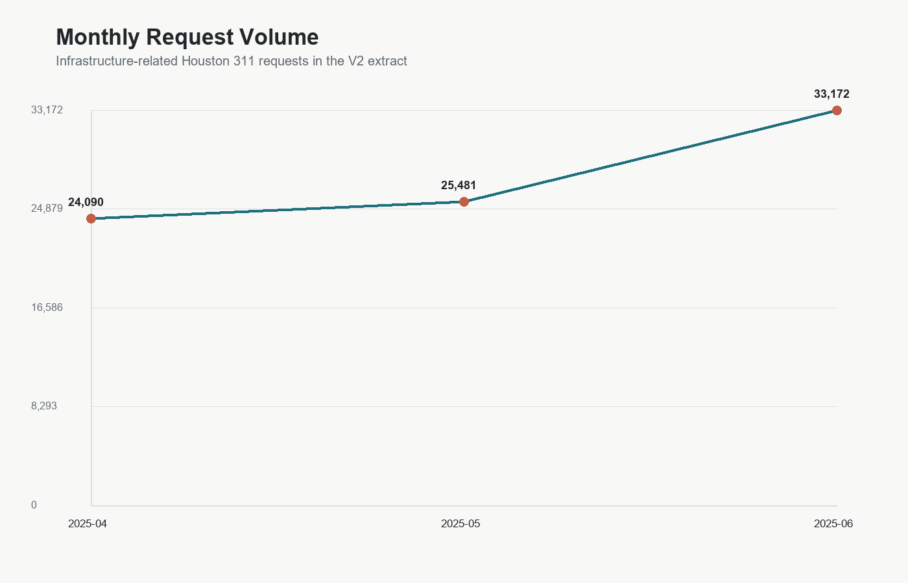

# Houston 311 Infrastructure Service Request Analysis

GIS and data analysis of Houston 311 infrastructure-related service requests, resolution times, repeat-location clusters, unresolved cases, and council-district service burden.

## Project Overview

This V2 portfolio project analyzes real City of Houston 311 service request records from the public ArcGIS archive. The work is designed as a technical analysis package rather than a dashboard: it includes reproducible scripts, official council-district boundary context, a cleaned processed dataset, QA/QC flags, summary tables, static charts, static maps, repeat-location screening, and a technical memo.

**Research question:** Which Houston areas show the highest infrastructure-service burden based on request volume, issue type, resolution time, unresolved cases, long-resolution cases, and recurring request clusters?

## V2 Data Scope

The committed V2 outputs use a bounded real-data extract from the City of Houston `Houston311_Archives` ArcGIS MapServer layer:

- Source: [Houston311_Archives MapServer layer](https://mycity2.houstontx.gov/gisweb01/rest/services/311/Houston311_Archives/MapServer/0)
- Query window: `2025-04-01` through `2025-06-30`
- Downloaded records: `82,743`
- Infrastructure filtering: request-type keyword screen for water, sewer, drainage, flooding, potholes, sidewalks, traffic signals, lighting, dumping, trash, recycling, garbage, bridges, streets, debris, and containers
- Boundary source: [COH_Council_Districts](https://www.gis.hctx.net/arcgis/rest/services/CoH/CoH_Boundaries/MapServer/0)

Raw extracts are generated locally in `data/raw/` and ignored by git. The full cleaned analytical CSV is committed in `data/processed/`.

## Key V2 Findings

- The April-June 2025 infrastructure extract contains `82,743` records with valid latitude/longitude values after basic QA screening.
- `Solid Waste / Recycling` is the largest standardized category with `43,194` requests, led by missed recycling pickup, missed garbage pickup, missed heavy-trash pickup, and container replacement.
- Overall median resolution time among records with usable closed dates is about `3.8` days.
- `Solid Waste / Recycling` has the highest median resolution time among major categories at about `8.1` days.
- `Drainage / Flooding` has the highest unresolved share among multi-record categories at about `20.0%`, followed by `Solid Waste / Recycling` at about `18.8%`.
- The V2 burden score ranks council district `H` as `Very High`. Districts `C`, `B`, `D`, `A`, and `K` rank `High`.
- Repeat-location screening detected `7,945` approximate coordinate/category clusters with at least three requests.

These are analytical findings from a bounded public-data extract, not official City performance measures.

## Showcase Outputs

### Main Map


### Supporting Visuals





## Repository Structure

```text
.
|-- README.md
|-- data/
|   |-- raw/
|   |-- processed/
|   |   `-- context/
|   `-- data_dictionary.csv
|-- docs/
|   |-- technical_memo.md
|   |-- methodology.md
|   |-- data_sources.md
|   `-- limitations.md
|-- outputs/
|   |-- maps/
|   |-- figures/
|   `-- tables/
|-- scripts/
|   |-- fetch_data.py
|   |-- fetch_boundaries.py
|   |-- clean_311_requests.py
|   |-- analyze_requests.py
|   |-- make_maps.py
|   `-- run_all.py
|-- requirements.txt
|-- .gitignore
`-- LICENSE
```

## How To Run

Install dependencies:

```bash
pip install -r requirements.txt
```

Run the full default V2 pipeline:

```bash
python scripts/run_all.py
```

Run a different source window:

```bash
python scripts/run_all.py --start-date 2025-04-01 --end-date 2025-07-01 --max-records 100000
```

Reuse an existing raw extract:

```bash
python scripts/run_all.py --skip-fetch
```

## Skills Demonstrated

- Public data acquisition from ArcGIS REST services
- Reproducible data pipeline design
- 311 service-request classification
- Date/time cleaning and resolution-time analysis
- QA/QC flags for missing dates, coordinates, categories, and invalid future closed dates
- Official council-district choropleth mapping
- Area-normalized service-burden screening
- Repeat-location cluster screening
- Static chart and map production
- Public-sector technical writing and limitations documentation

## Limitations

V2 uses official district polygons for map display and area-normalized request density, but aggregation still relies on the source record's council-district attribute rather than a point-in-polygon spatial join. Population normalization and ACS vulnerability overlays remain V3 candidates.
