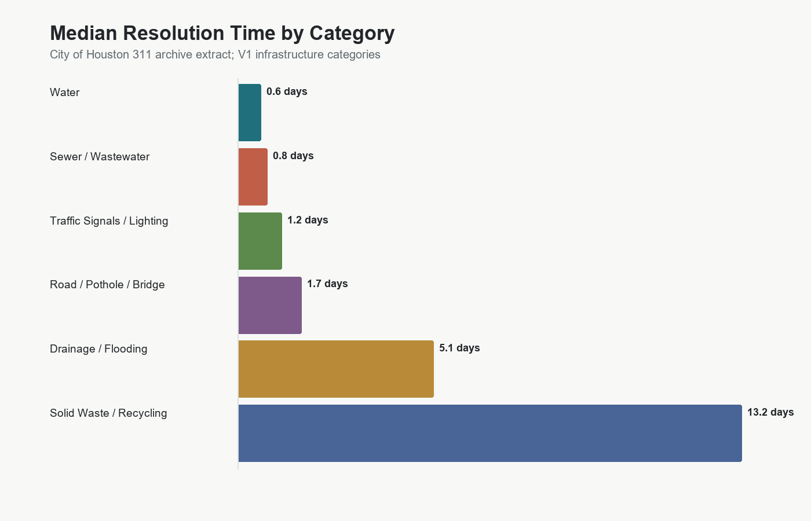
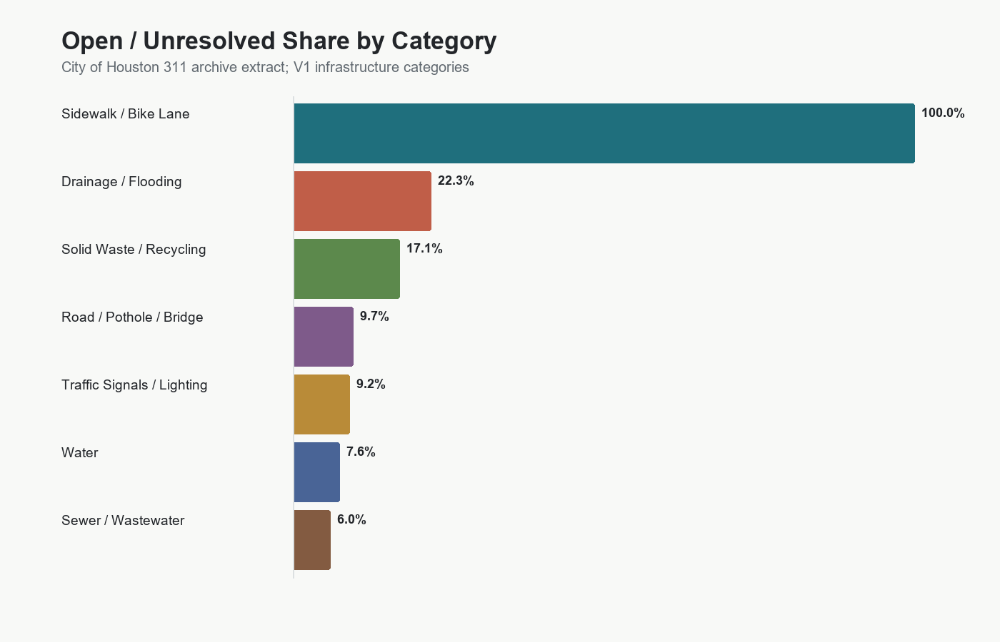
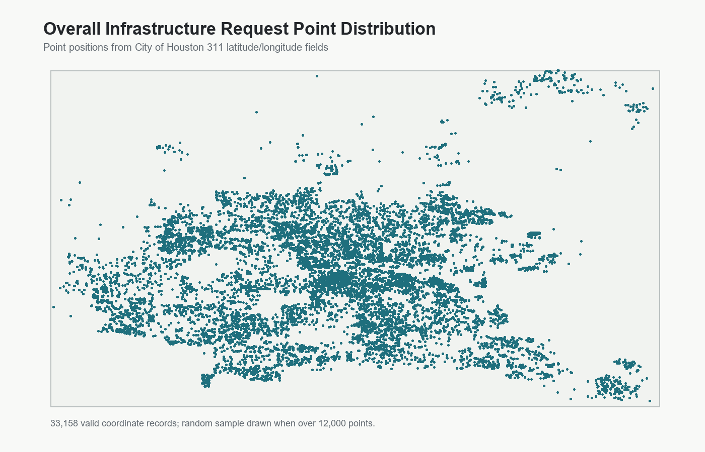
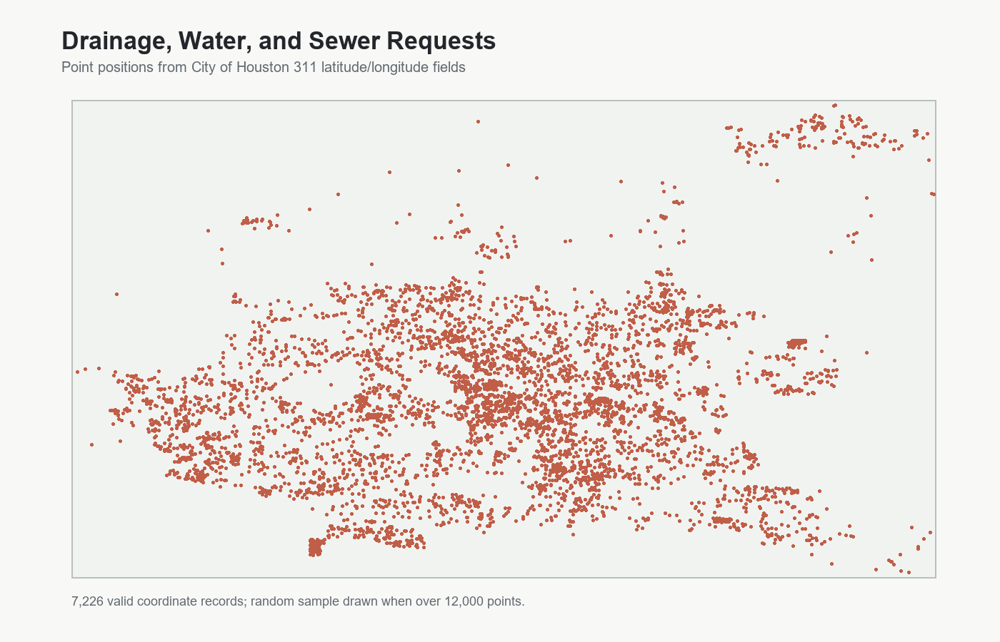
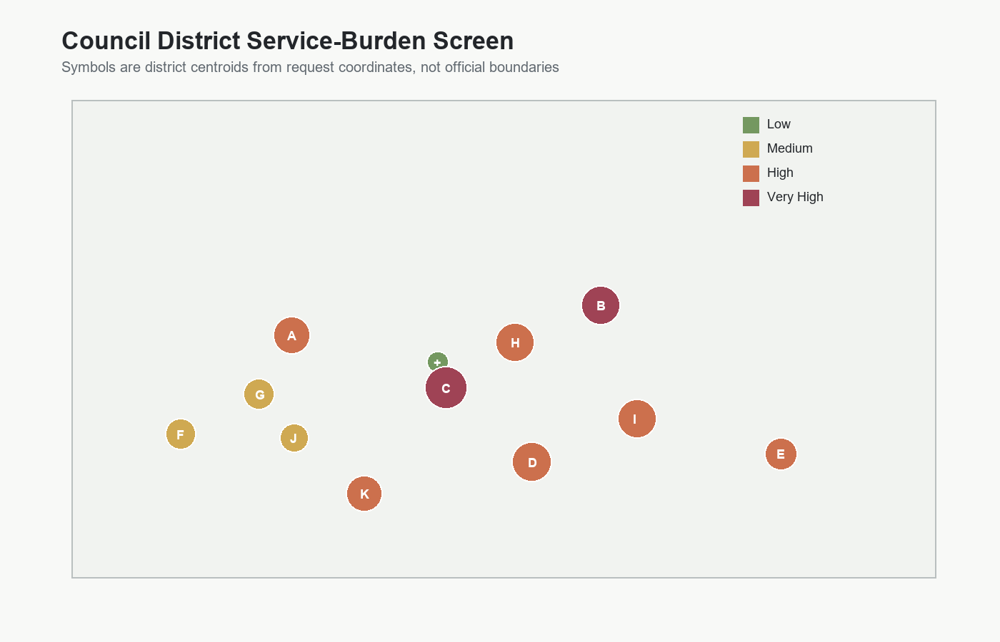

# Houston 311 Infrastructure Service Request Analysis

GIS and data analysis of Houston 311 infrastructure-related service requests, resolution times, unresolved cases, and council-district service burden.

## Project Overview

This V1 portfolio project analyzes real City of Houston 311 service request records from the public ArcGIS archive. The work is designed as a technical analysis package rather than a dashboard: it includes reproducible scripts, a cleaned processed dataset, QA/QC flags, summary tables, static charts, static maps, and a technical memo.

**Research question:** Which Houston areas show the highest infrastructure-service burden based on request volume, issue type, resolution time, unresolved cases, and long-resolution cases?

## V1 Data Scope

The committed V1 outputs use a bounded real-data extract from the City of Houston `Houston311_Archives` ArcGIS MapServer layer:

- Source: [Houston311_Archives MapServer layer](https://mycity2.houstontx.gov/gisweb01/rest/services/311/Houston311_Archives/MapServer/0)
- Query window: `2025-06-01` through `2025-06-30`
- Downloaded records: `33,172`
- Infrastructure filtering: request-type keyword screen for water, sewer, drainage, flooding, potholes, sidewalks, traffic signals, lighting, dumping, trash, recycling, garbage, bridges, streets, debris, and containers

Raw extracts are generated locally in `data/raw/` and ignored by git. The full cleaned analytical CSV is committed in `data/processed/`.

## Key V1 Findings

- The June 2025 infrastructure extract contains `33,172` records with valid latitude/longitude values after basic QA screening.
- `Solid Waste / Recycling` is the largest standardized category with `19,707` requests, led by missed recycling pickup, missed garbage pickup, and missed heavy-trash pickup.
- Overall median resolution time among records with usable closed dates is about `6.8` days.
- `Solid Waste / Recycling` has the highest median resolution time among major categories at about `13.2` days.
- `Drainage / Flooding` has the highest unresolved share among multi-record categories at about `22.3%`.
- The V1 council-district burden screen ranks districts `C` and `B` as `Very High`, based on volume, median resolution time, unresolved share, and long-resolution share.

These are analytical findings from a bounded public-data extract, not official City performance measures.

## Outputs

### Figures






### Maps







## Repository Structure

```text
.
├── README.md
├── data/
│   ├── raw/
│   ├── processed/
│   └── data_dictionary.csv
├── docs/
│   ├── technical_memo.md
│   ├── methodology.md
│   ├── data_sources.md
│   └── limitations.md
├── outputs/
│   ├── maps/
│   ├── figures/
│   └── tables/
├── scripts/
│   ├── fetch_data.py
│   ├── clean_311_requests.py
│   ├── analyze_requests.py
│   ├── make_maps.py
│   └── run_all.py
├── requirements.txt
├── .gitignore
└── LICENSE
```

## How To Run

Install dependencies:

```bash
pip install -r requirements.txt
```

Run the full default V1 pipeline:

```bash
python scripts/run_all.py
```

Run a different source window:

```bash
python scripts/run_all.py --start-date 2025-06-01 --end-date 2025-07-01 --max-records 50000
```

Reuse an existing raw extract:

```bash
python scripts/run_all.py --skip-fetch
```

## Skills Demonstrated

- Public data acquisition from an ArcGIS REST service
- Reproducible data pipeline design
- 311 service-request classification
- Date/time cleaning and resolution-time analysis
- QA/QC flags for missing dates, coordinates, categories, and invalid future closed dates
- Council-district service-burden screening
- Static chart and map production
- Public-sector technical writing and limitations documentation

## Limitations

V1 uses the source layer's council-district attribute rather than official district boundary polygons, so the burden score is an attribute-based screening result rather than a boundary-normalized GIS overlay. Population normalization and formal repeat-request clustering are reserved for V2.
