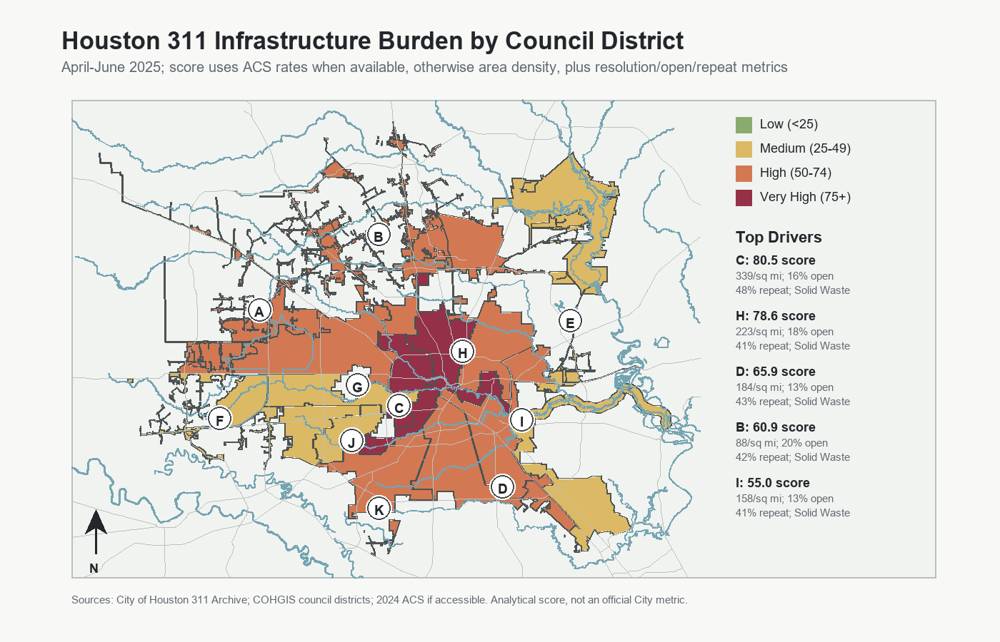
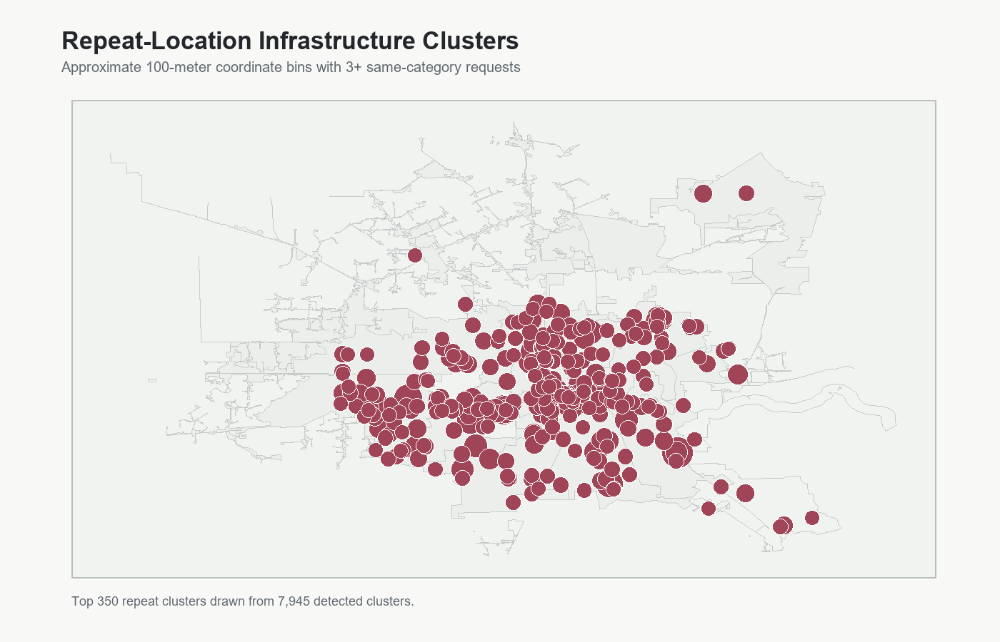
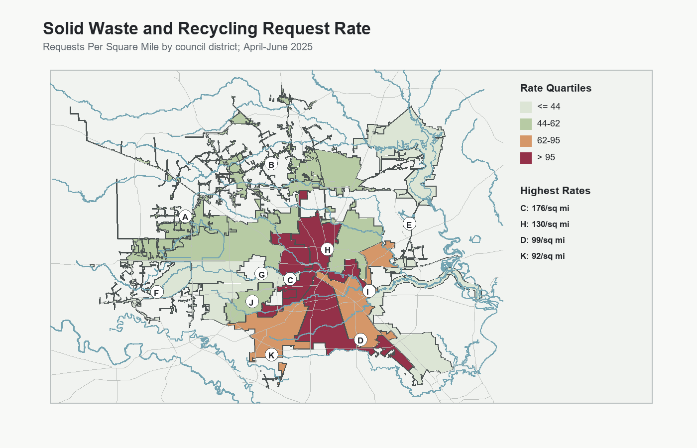
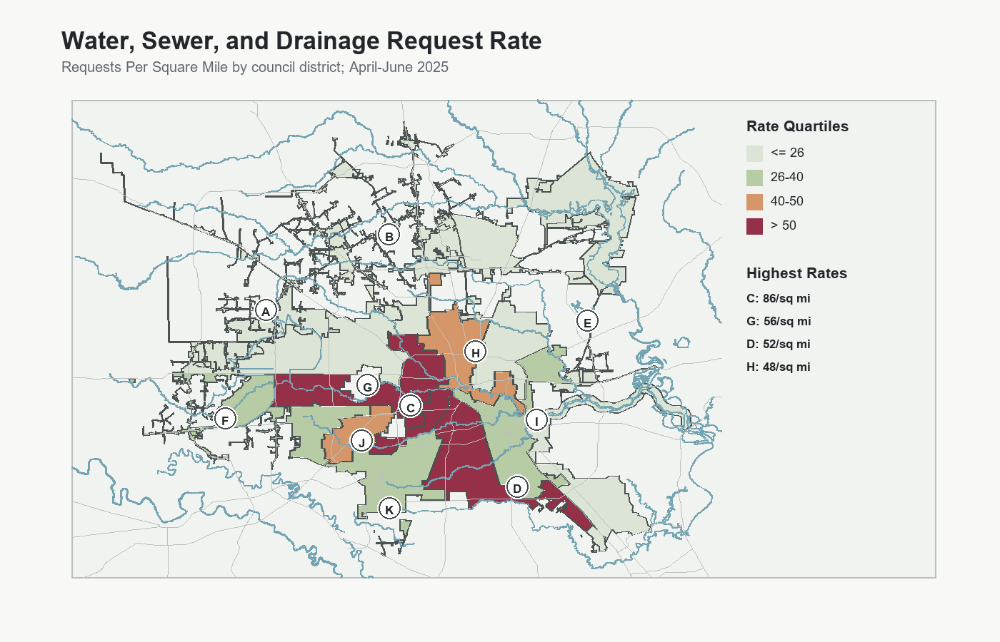
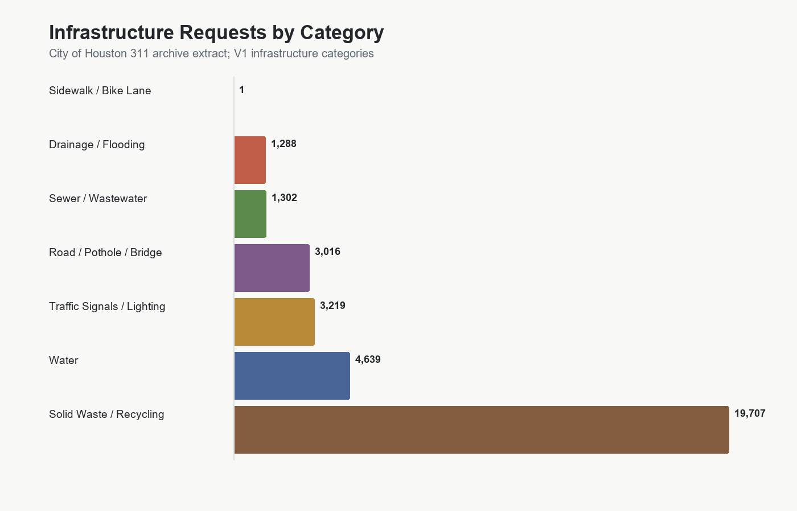

# Houston 311 Infrastructure Service Request Analysis

Portfolio-ready GIS and data analysis of Houston 311 infrastructure-related service requests, resolution times, repeat-location clusters, unresolved cases, and council-district service burden.

The repository's primary showcase artifact is the council-district service-burden map:



## Project Overview

This V3 portfolio project analyzes real City of Houston 311 service request records from the public ArcGIS archive. It is a technical analysis package with a static interactive showcase: reproducible scripts, official council-district boundaries, point-in-polygon district assignment, optional ACS demographic normalization, QA/QC flags, summary tables, static charts, static maps, repeat-location screening, GitHub Pages-ready HTML, and public-sector documentation.

**Research question:** Which Houston areas show the highest infrastructure-service burden based on request volume, issue type, resolution time, unresolved cases, long-resolution cases, and recurring request clusters?

The project is designed to be understandable as a public-sector analytics case study: the code can be rerun, the assumptions are documented, and the main visual can be used directly in a portfolio or project write-up.

## V3 Data Scope

- 311 source: [Houston311_Archives MapServer layer](https://mycity2.houstontx.gov/gisweb01/rest/services/311/Houston311_Archives/MapServer/0)
- Query window: `2025-04-01` through `2025-06-30`
- Downloaded records: `82,743`
- Boundary source: [COH_Council_Districts](https://www.gis.hctx.net/arcgis/rest/services/CoH/CoH_Boundaries/MapServer/0)
- Map context sources: [H-GAC Major Roads](https://gis.h-gac.com/arcgis/rest/services/Open_Data/Transportation/MapServer/9) and [H-GAC Major Rivers](https://gis.h-gac.com/arcgis/rest/services/Open_Data/Environment/MapServer/1)
- Demographic source: 2024 ACS 5-year API and Census TIGERweb tract internal points, enabled when a valid `CENSUS_API_KEY` is available

In this coding environment, the Census API rejected the supplied key. V3 therefore records the ACS access limitation and falls back to area-normalized rates. The demographic fetch script is ready to produce population and household rates once a valid `CENSUS_API_KEY` is set.

## What The Score Means

The V3 service-burden score is an analytical index. It combines request rate, resolution time, unresolved share, long-resolution share, and repeat-location share into a 0-100 style percentile score by council district. Higher scores mean a district had a heavier observed 311 infrastructure burden in this bounded extract.

When ACS demographics are available, request rates are normalized by estimated residents and households. When ACS is unavailable, the pipeline uses requests per square mile as a documented fallback. That makes the current output publishable, while keeping the path open for population-normalized V3.1/V4 outputs later.

The score is not an official City of Houston metric, not a causal model, and not a complete measure of infrastructure condition.

## Key V3 Findings

- The April-June 2025 extract contains `82,743` cleaned infrastructure-related records.
- `Solid Waste / Recycling` remains the largest category with `43,194` requests.
- Overall median resolution time among records with usable closed dates is about `3.8` days.
- Overall unresolved share is about `15.5%`.
- About `42.0%` of records fall in approximate repeat-location clusters.
- Under the V3 score, council district `C` ranks `Very High`; district `H` is also `Very High`.
- Repeat-location screening detected `7,945` approximate coordinate/category clusters with at least three requests.

These are analytical findings from a bounded public-data extract, not official City performance measures.

## Showcase Outputs

### Main Map


### Interactive Showcase

Open [`index.html`](index.html) locally through a small static server, or use the GitHub Pages workflow included in `.github/workflows/pages.yml`.

### Supporting Visuals









More generated artifacts are listed in [`outputs/index.md`](outputs/index.md).

## How To Run

Install dependencies:

```bash
pip install -r requirements.txt
```

Run the full default V3 pipeline:

```bash
python scripts/run_all.py
```

Run with Census ACS normalization:

```bash
set CENSUS_API_KEY=your_key_here
python scripts/run_all.py
```

Reuse the 311 raw extract while refreshing boundaries/demographics:

```bash
python scripts/run_all.py --skip-fetch
```

Reuse both the 311 extract and existing context files:

```bash
python scripts/run_all.py --skip-fetch --skip-context
```

Run tests:

```bash
python -m unittest discover -s tests
```

Run the same checks used by CI:

```bash
python -m unittest discover -s tests
python -m compileall scripts tests
```

## Configurable Analysis Settings

The main analysis settings live in `config/analysis_config.json`: date range, max records, long-resolution threshold, repeat-cluster threshold, and service-burden score weights.

| Component | Weight |
|---|---:|
| Resident request rate, or area density fallback | 25% |
| Household request rate, or area density fallback | 15% |
| Median resolution days | 20% |
| Unresolved share | 15% |
| Long-resolution share | 10% |
| Repeat-cluster share | 15% |

The same settings are read by the scripts, so scoring changes can be made in one auditable place.

## Repository Structure

```text
.
|-- README.md
|-- Makefile
|-- index.html
|-- .github/
|-- config/
|   `-- analysis_config.json
|-- data/
|   |-- raw/
|   |-- processed/
|   |   `-- context/
|   `-- data_dictionary.csv
|-- docs/
|   |-- executive_summary.md
|   |-- technical_memo.md
|   |-- methodology.md
|   |-- data_sources.md
|   |-- limitations.md
|   |-- changelog.md
|   |-- project_brief.md
|   |-- presentation_outline.md
|   |-- future_work.md
|   `-- portfolio_page.html
|-- outputs/
|   |-- maps/
|   |-- figures/
|   `-- tables/
|-- scripts/
|-- tests/
|-- requirements.txt
|-- .gitignore
`-- LICENSE
```

## Skills Demonstrated

- Public data acquisition from ArcGIS REST services
- Reproducible data pipeline design
- 311 service-request classification
- Point-in-polygon spatial assignment
- Date/time cleaning and resolution-time analysis
- Optional ACS demographic normalization
- Repeat-location cluster screening
- Official council-district choropleth mapping
- Static chart and map production
- Static interactive showcase design
- GitHub Actions CI and Pages deployment
- Public-sector technical writing and limitations documentation

## Limitations

V3 performs point-in-polygon district assignment and supports ACS normalization, but ACS data could not be fetched in this environment with the supplied Census API key. The current committed score therefore uses area density as the rate component. Population normalization, ACS overlays, and tract demographic summaries can be regenerated by setting a valid `CENSUS_API_KEY`.

This project does not claim to measure all infrastructure need, resident satisfaction, official City performance, or causal drivers. It ranks patterns visible in a bounded 311 extract.
