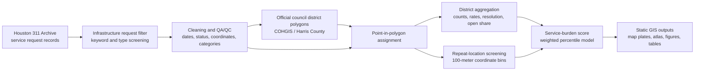

# Geoprocessing Workflow

## Notes

- The committed V3.2 output uses requests per square mile as the rate component because ACS API access was not successful with the supplied key.
- ACS resident and household rate fields are supported by the pipeline and can be regenerated when a valid Census API key is available.
- The workflow produces static GIS outputs. The optional `index.html` file is a viewer for committed artifacts, not the analytical product itself.
